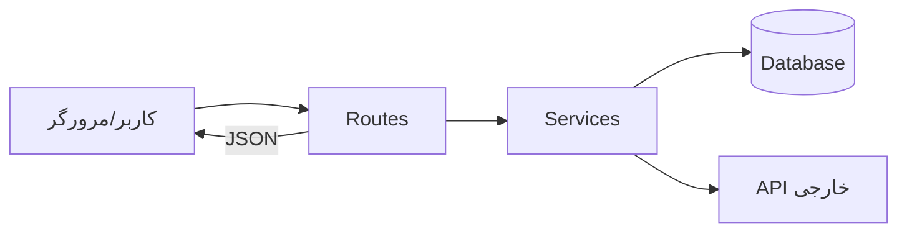
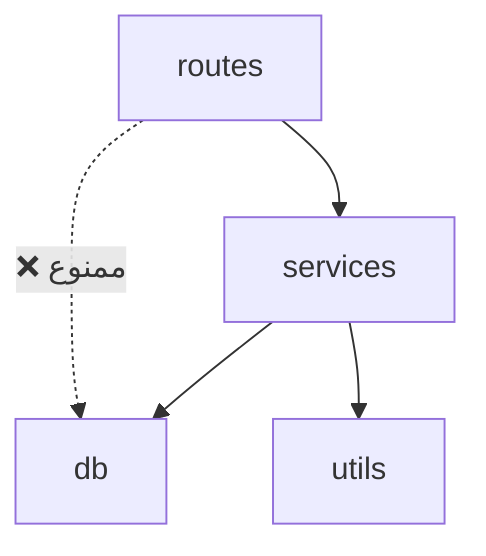

# Architecture Mapper — ترسیمات شاخه‌ای و نقشه‌ی معماری

ذهنیت: **معمار.** هیچ ساختمانی بدون نقشه ساخته نمی‌شود.
خروجی این اسکیل، فایل `ARCHITECTURE.md` در ریشه‌ی پروژه است — نقشه‌ی زنده‌ی پروژه.

## 📄 محتوای الزامی `ARCHITECTURE.md`

### ۱. درخت شاخه‌ای فایل‌ها (با توضیح نقش هر بخش)

```
myproject/
├── src/
│   ├── routes/          ← تعریف endpointها (هر فایل = یک دامنه)
│   │   ├── auth.js      ← لاگین/ثبت‌نام/JWT
│   │   └── items.js     ← CRUD آیتم‌ها
│   ├── services/        ← منطق کسب‌وکار (بدون دانش HTTP)
│   ├── db/              ← مدل‌ها و مایگریشن‌ها
│   └── utils/           ← توابع کمکی خالص
├── tests/               ← آینه‌ی ساختار src
├── .project-memory/     ← حافظه‌ی پروژه
├── PLAN.md
└── ARCHITECTURE.md      ← همین فایل
```

### ۲. دیاگرام جریان داده (Mermaid)



### ۳. نقشه‌ی وابستگی ماژول‌ها



قانون طلایی: **جهت وابستگی همیشه یک‌طرفه است.** لایه‌ی بالا لایه‌ی پایین را صدا می‌زند، هرگز برعکس.

### ۴. جدول مسئولیت‌ها

| ماژول | مسئولیت (یک جمله) | نباید بداند |
|---|---|---|
| routes | دریافت request و بازگرداندن response | جزئیات DB |
| services | منطق کسب‌وکار | HTTP و framework |
| db | ذخیره و بازیابی داده | منطق کسب‌وکار |

### ۵. تصمیم‌های ساختاری کلیدی
لینک به `decisions.md` — هر تصمیم معماری آن‌جا ثبت می‌شود.

## 🔄 قوانین به‌روزرسانی

1. **قبل از شروع Phase 1:** نسخه‌ی اولیه‌ی کامل ساخته شود.
2. **هر فایل/پوشه‌ی جدید:** بلافاصله به درخت اضافه شود.
3. **هر تغییر در جریان داده:** دیاگرام Mermaid به‌روز شود.
4. **قبل از هر تصمیم ساختاری:** اول نقشه را ببین — اگر تغییر با نقشه تضاد دارد، اول نقشه اصلاح و در `decisions.md` ثبت شود.
5. نقشه‌ی کهنه بدتر از نبودِ نقشه است — به‌روز نگه‌داشتنش بخشی از DoD هر تسک ساختاری است.

## ⛔ علائم معماری بیمار

- فایلی بیش از ~۳۰۰ خط → باید شکسته شود
- ماژولی که «همه‌چیز» را می‌داند (God module)
- وابستگی حلقوی (A→B→A) → ممنوع مطلق
- منطق کسب‌وکار داخل route یا کامپوننت UI
